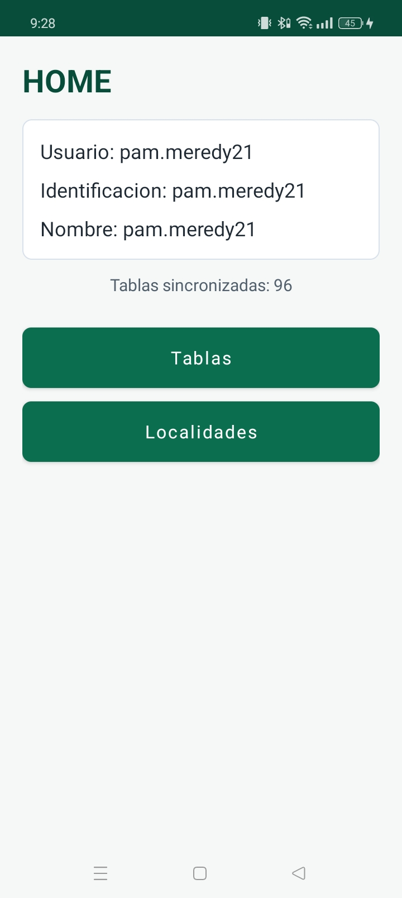
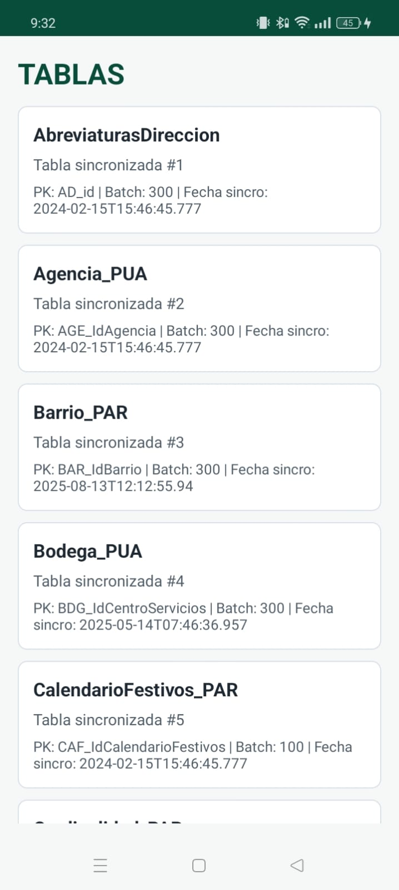
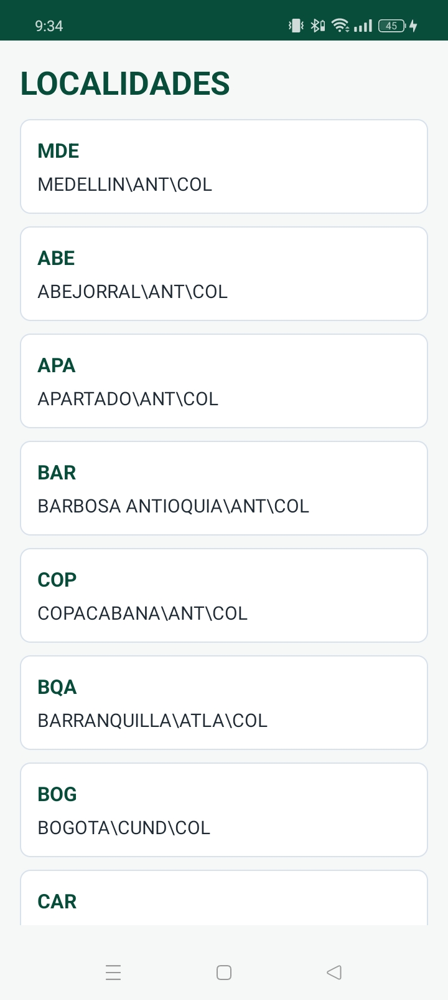
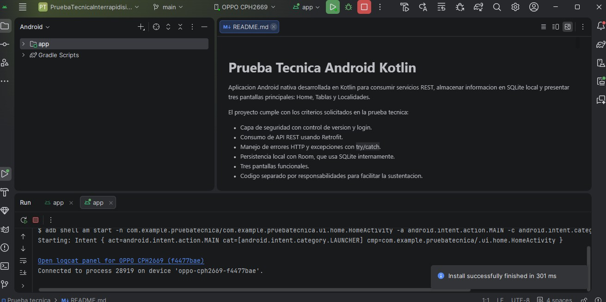

# Prueba Tecnica Android Kotlin

Aplicacion Android nativa desarrollada en Kotlin para consumir servicios REST, almacenar informacion en SQLite local y presentar tres pantallas principales: Home, Tablas y Localidades.

El proyecto cumple con los criterios solicitados en la prueba tecnica:

- Capa de seguridad con control de version y login.
- Consumo de API REST usando Retrofit.
- Manejo de errores HTTP y excepciones con `try/catch`.
- Persistencia local con Room, que usa SQLite internamente.
- Tres pantallas funcionales.
- Codigo separado por responsabilidades para facilitar la sustentacion.

## Evidencias de ejecucion

### Pantalla Home

### Pantalla Tablas

### Pantalla Localidades

### Evidencia de Compilacion

## Como abrir el proyecto

1. Abrir Android Studio.
2. Seleccionar `Open`.
3. Elegir la carpeta `C:\Users\MICHAEL\Documents\Unal\Ing II\Prueba tecnica`.
4. Esperar la sincronizacion de Gradle.
5. Ejecutar el modulo `app`.

## APK generado

La compilacion debug genera el APK en:

`app/build/outputs/apk/debug/app-debug.apk`

## Flujo de la aplicacion

1. `HomeActivity` inicia la aplicacion.
2. Se consulta la version remota del aplicativo.
3. Se compara la version remota contra `versionName`, configurada en `app/build.gradle.kts`.
4. Se ejecuta el login con el endpoint de seguridad.
5. Si el login responde HTTP 200, se extraen `Usuario`, `Identificacion` y `Nombre`.
6. Los datos del usuario se guardan en SQLite local.
7. Se consume el endpoint de esquema `ObtenerEsquema/true`.
8. Las tablas retornadas se guardan en SQLite.
9. Desde Home se puede navegar a `Tablas` o `Localidades`.

## Endpoints usados

### Control de Version

`GET https://apitesting.interrapidisimo.co/apicontrollerpruebas/api/ParametrosFramework/ConsultarParametrosFramework/VPStoreAppControl`

Se compara la version remota contra la version local de la app:

- Si la version local es inferior, se muestra un mensaje.
- Si la version local es superior, se muestra un mensaje.
- Si son iguales, se informa que coinciden.

### Login

`POST https://apitesting.interrapidisimo.co/FtEntregaElectronica/MultiCanales/ApiSeguridadPruebas/api/Seguridad/AuthenticaUsuarioApp`

Se envian los headers y el body indicados en el enunciado. Si la respuesta HTTP es diferente de 200, se muestra alerta. Si responde 200, se guardan localmente:

- `Usuario`
- `Identificacion`
- `Nombre`

### Esquema de Tablas

`GET https://apitesting.interrapidisimo.co/apicontrollerpruebas/api/SincronizadorDatos/ObtenerEsquema/true`

Este endpoint se consume con headers de seguridad. Las tablas retornadas se almacenan en SQLite y luego se muestran en la pantalla `Tablas`.

Campos guardados:

- `NombreTabla`
- `Pk`
- `BatchSize`
- `FechaActualizacionSincro`

### Localidades

`GET https://apitesting.interrapidisimo.co/apicontrollerpruebas/api/ParametrosFramework/ObtenerLocalidadesRecogidas`

La pantalla `Localidades` muestra:

- `AbreviacionCiudad`
- `NombreCompleto`

## Directorios principales

### `data/local`

Contiene la base de datos local Room.

- `AppDatabase.kt`: crea la base de datos `prueba_tecnica.db`.
- `UserEntity.kt`: representa la tabla local `usuarios`.
- `SchemaTableEntity.kt`: representa la tabla local `tablas_sincronizadas`.
- `UserDao.kt`: inserta y consulta el usuario.
- `SchemaTableDao.kt`: borra, inserta y consulta tablas sincronizadas.

### `data/model`

Contiene modelos de datos que no son tablas locales.

- `LoginRequest.kt`: body JSON enviado al endpoint de login.
- `Locality.kt`: modelo usado para mostrar localidades.

### `network`

Contiene el consumo REST.

- `ApiService.kt`: declara los endpoints de la prueba.
- `RetrofitClient.kt`: configura Retrofit, OkHttp, timeouts y logs HTTP.
- `ApiResult.kt`: clase sellada para representar exito o error.

### `repository`

Contiene la logica que coordina API y base de datos.

- `AppRepository.kt`: maneja `try/catch`, valida codigos HTTP, interpreta respuestas y guarda datos locales.

### `ui`

Contiene la capa de presentacion.

- `home`: pantalla principal con usuario, identificacion, nombre y botones.
- `tables`: pantalla que lee y muestra las tablas guardadas en SQLite.
- `localities`: pantalla que consume y muestra localidades.
- `ViewModelFactory.kt`: crea los ViewModels con el repositorio compartido.

### `utils`

Contiene utilidades reutilizables.

- `JsonParserUtils.kt`: extrae campos del JSON recibido por los servicios.
- `VersionComparator.kt`: compara versiones como `1.0.0`, `1.2.0`, etc.

## Manejo de errores

La app usa `try/catch` en `AppRepository.kt` para controlar:

- errores de red;
- respuestas HTTP diferentes de 200;
- respuestas vacias;
- errores inesperados de parseo o ejecucion.

Cuando ocurre un error, la interfaz muestra un `AlertDialog` con el mensaje correspondiente.

## Explicacion corta para sustentacion

La aplicacion esta separada por capas:

- `network` se encarga de comunicarse con los endpoints.
- `repository` coordina API, validaciones y base de datos.
- `data/local` guarda informacion en SQLite mediante Room.
- `ui` muestra la informacion en pantalla.
- `utils` contiene funciones auxiliares para parsear JSON y comparar versiones.

Esta separacion ayuda a cumplir principios SOLID porque cada archivo tiene una responsabilidad clara y es mas facil mantener, probar y explicar el codigo.
