# Laboratorio SSH

Michael Sebastian Caicedo Rosero

En general, lo realizado en los puntos consistió en implementar la lógica básica para actualizar una tarea de forma segura dentro de una API REST para un primer endpoint.

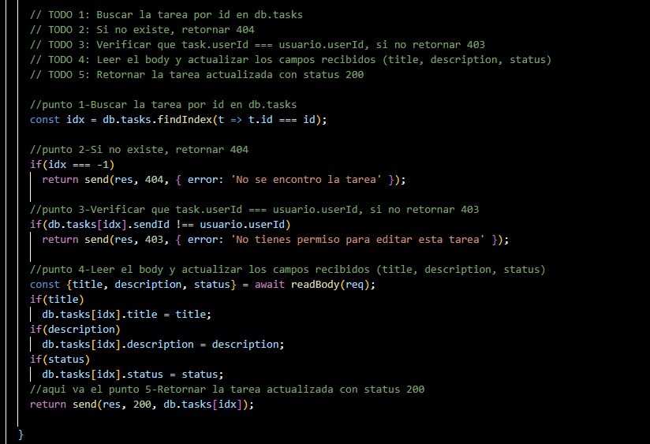

Para un segundo endpoint se implementó la lógica necesaria para eliminar tareas de manera segura dentro de la API.

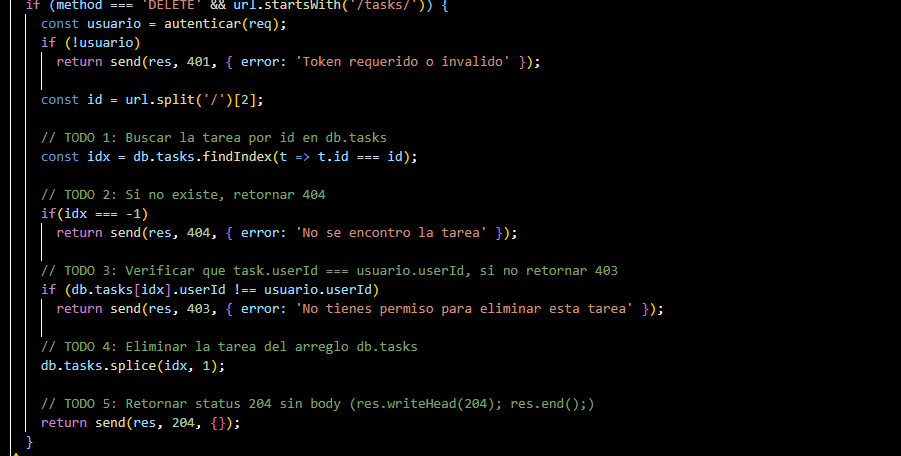

## 1. Registro de usuario

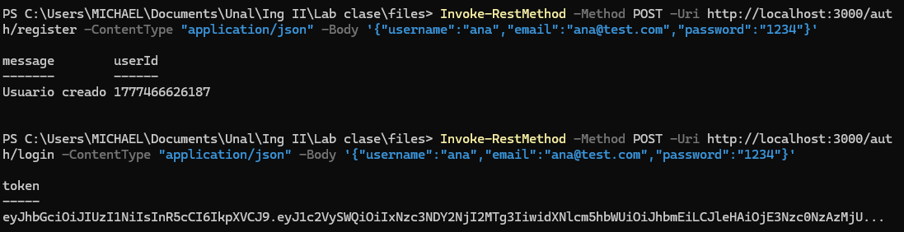

## 2. Guardar y verificar el token

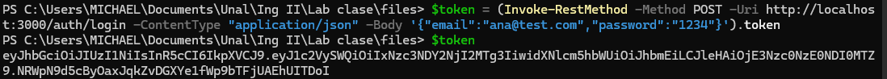

## 3. Crear y ver lista de tareas

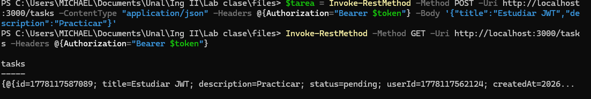

## 4. Actualizar y eliminar tarea

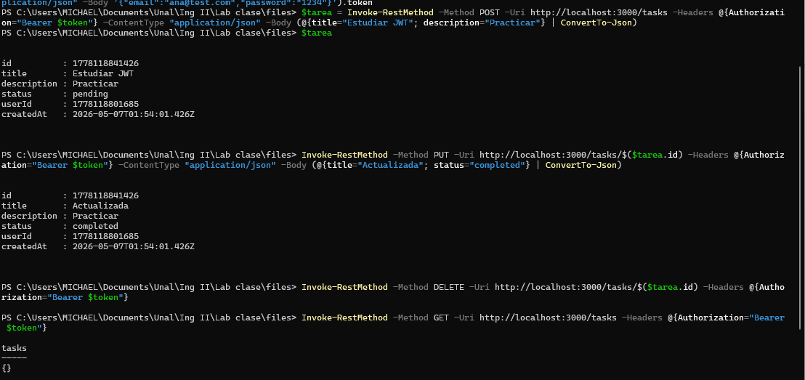

Posteriormente se modificó el servidor para que escuchara solicitudes provenientes de toda la red local.

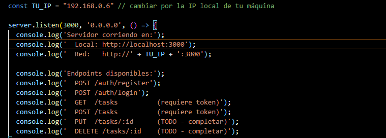

Después se instaló el servicio OpenSSH Server en Windows utilizando PowerShell con permisos de administrador mediante el comando:

`Add-WindowsCapability -Online -Name OpenSSH.Server~~~~0.0.1.0`

Luego se verificó que el servicio estuviera disponible con:

`Get-Service sshd`

Posteriormente se inició el servicio SSH usando:

`Start-Service sshd`

Después nos conectamos a Termius desde el celular utilizando la misma red WiFi.

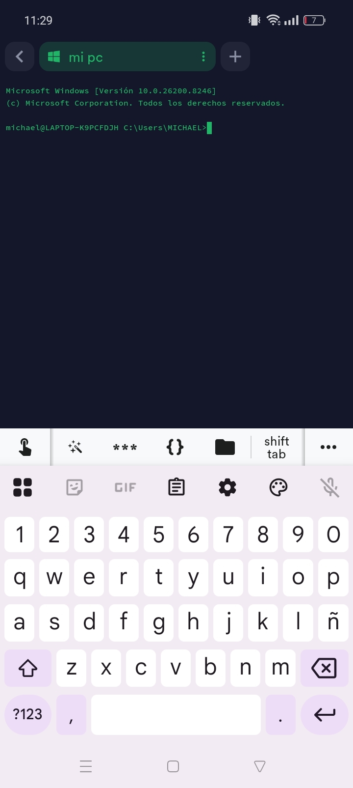

## 5. Registro y login

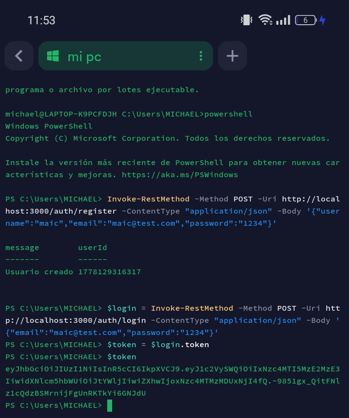

## 6. Crear tarea

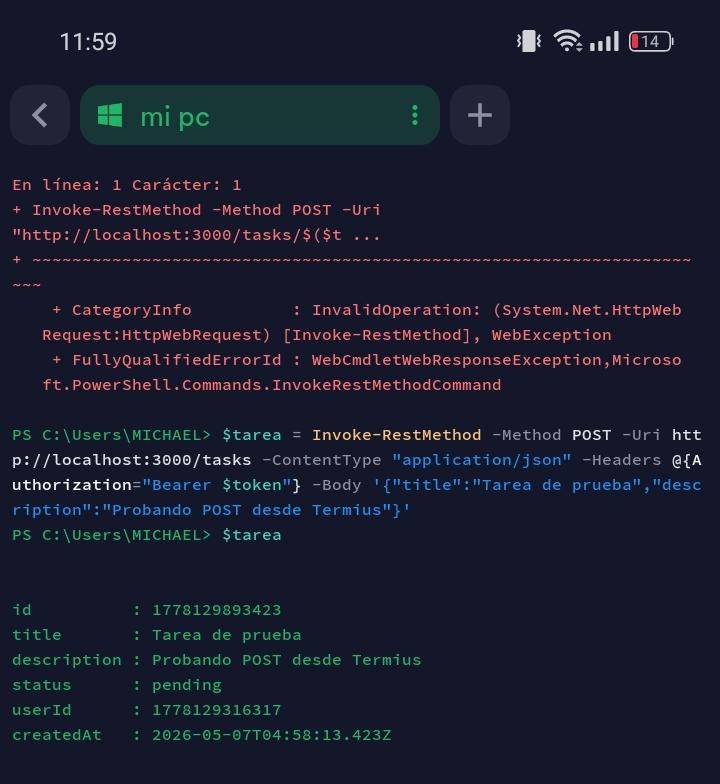

## 7. Modificar tarea

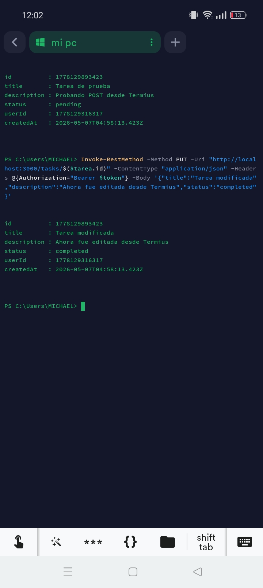