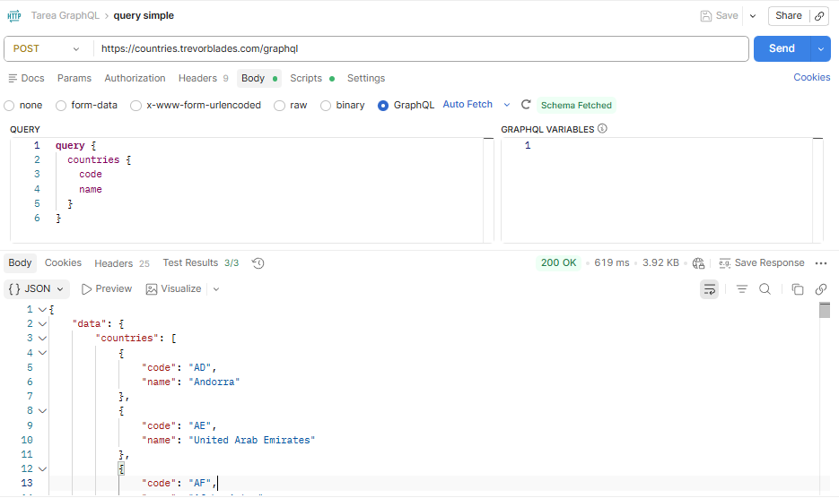
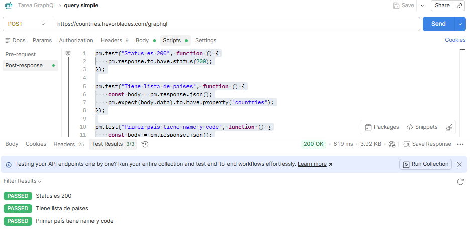
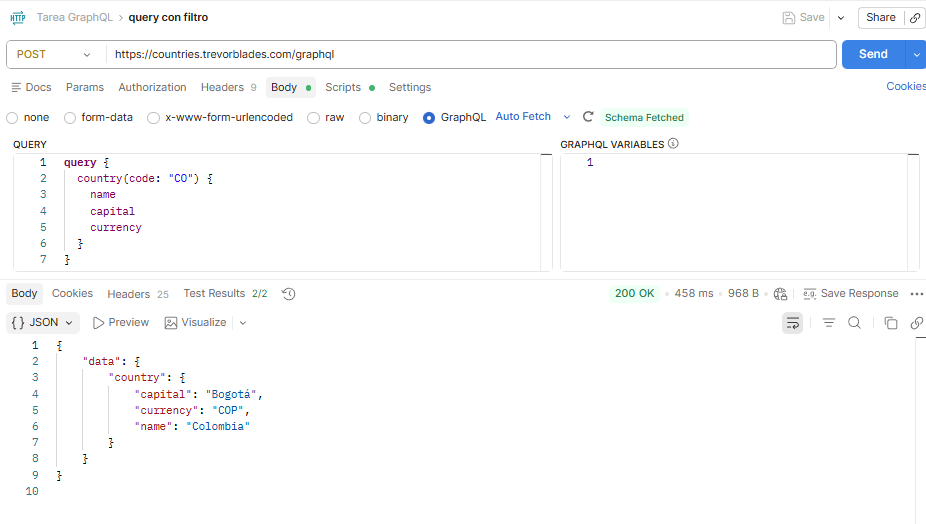
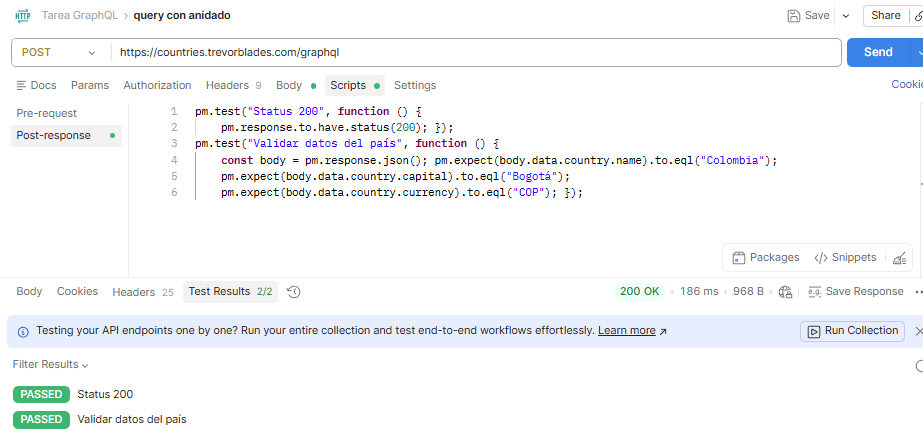
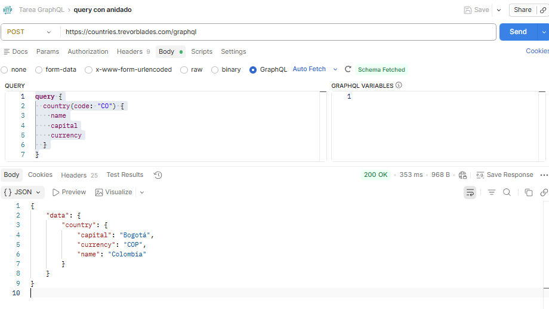
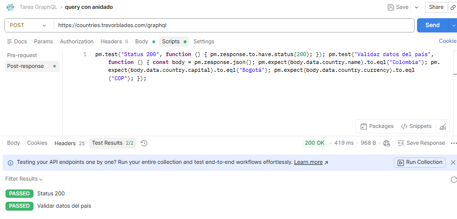
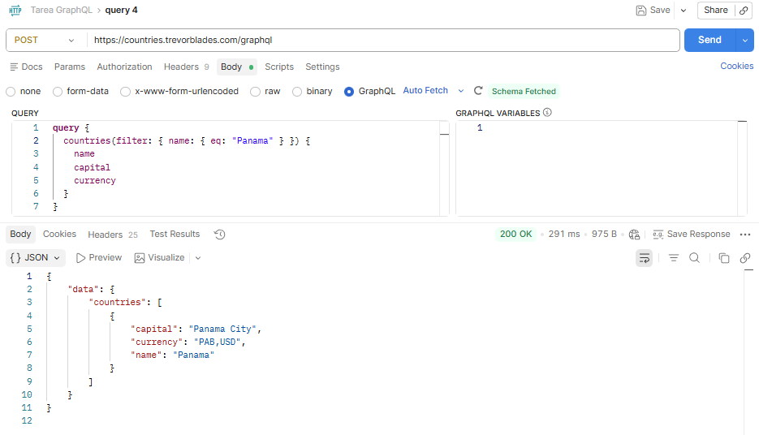
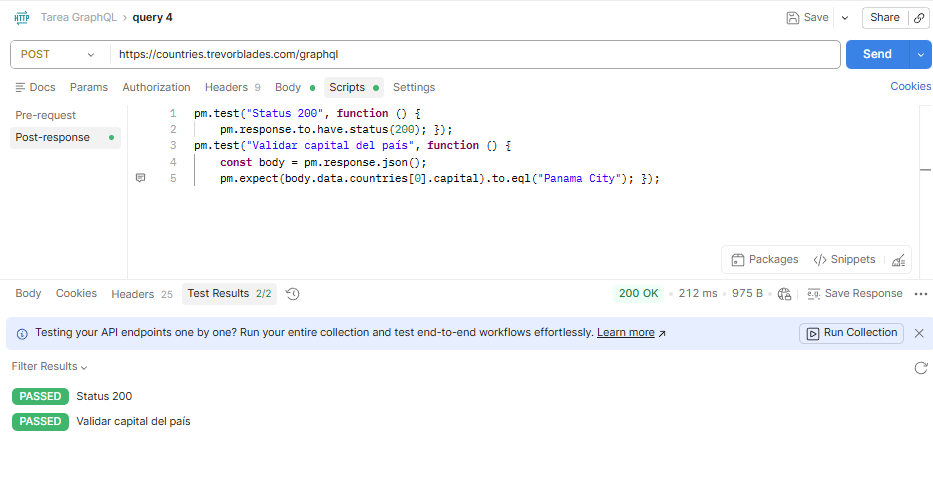
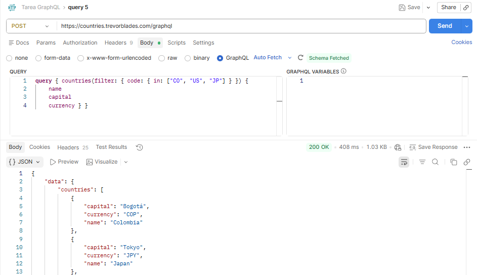
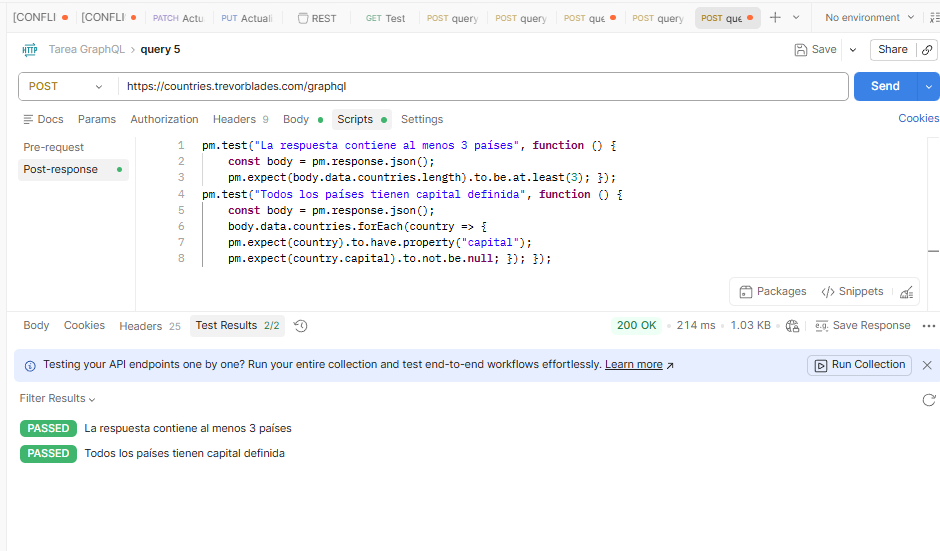

**Tarea GraphQL**

Michael Sebastian Caicedo Rosero

Se va ha utilizar [https://countries.trevorblades.com/graphql](https://countries.trevorblades.com/graphql) con el fin de generar los queries. 

1. En el primer ejercicio se realiza un método POST con un query simple, el cual muestra una lista de países. Por cada país se visualizan las dos letras que lo representan y su nombre.  
    
   se realiza los siguientes test  
     
   Estos tests se realizaron para verificar que la respuesta de la API sea correcta y tenga la estructura esperada. Primero se valida que el código de estado sea 200, lo que indica que la petición fue exitosa. Luego se comprueba que la respuesta contenga la propiedad “countries” dentro de “data”, asegurando que se recibió la lista de países. Finalmente, se verifica que el primer país tenga los campos “name” y “code”, confirmando que los datos están completos y bien estructurados.  
     
2. Se realiza un POST con un query con filtro, donde se busca el país con el código “CO”, correspondiente a Colombia.  
     
     
   En los tests se valida que el servidor responda con un código 200 y se incluye una función que comprueba que el país Colombia se encuentra en la respuesta.  
     
3. Se realiza un POST para un query anidado. En este caso, dentro del objeto principal country se solicitan campos específicos como name, capital y currency. Esto significa que la consulta no solo pide el recurso, sino también propiedades internas en una sola estructura jerárquica.  
   El servidor responde con un JSON que refleja esa misma estructura anidada, donde los datos del país aparecen dentro de data → country, incluyendo únicamente los campos solicitados. Esto demuestra cómo GraphQL permite realizar consultas precisas en una sola petición.  
     
   Para la query anidada que consulta el país (Panamá) y sus campos específicos, se pueden definir los siguientes tests en Postman:  
     
     
4. Esta consulta busca países cuyo nombre sea “Colombia” y devuelve únicamente los campos name, capital y currency. A diferencia de consultar por código, aquí se utiliza un filtro por nombre, lo que permite realizar búsquedas más flexibles.  
     
   Para la query por nombre de país, donde se desea obtener la capital, se pueden definir los siguientes tests en Postman:  
     
     
   El primer test verifica que la respuesta del servidor sea exitosa (código 200). El segundo test valida que la capital del país consultado sea “Bogotá”, confirmando que la query por nombre está devolviendo correctamente la información esperada.  
     
5. Esta query permite obtener información de múltiples países en una sola petición. En este caso, se consultan Colombia, Estados Unidos y Japón, devolviendo sus nombres, capitales y monedas. Es útil cuando se necesita comparar datos entre varios países sin hacer múltiples requests.  
     
     
   Para esta query que consulta múltiples países, se pueden definir dos tests diferentes a los anteriores:  
   

**¿Qué diferencia encontraste vs REST?**  
 La principal diferencia que noté es que con GraphQL puedo pedir exactamente los datos que necesito en una sola consulta, mientras que en REST normalmente el servidor ya define qué devuelve cada endpoint. En REST a veces llega información de más o toca hacer varias peticiones, en cambio con GraphQL todo es más flexible y preciso.

**¿Cuántos requests REST necesitarías para reemplazar tu query más compleja?**  
En mi caso, necesitaría varias peticiones en REST, probablemente entre 2 y 3, dependiendo de los datos. Esto porque tendría que consultar primero una lista y luego hacer otras peticiones para obtener detalles adicionales, mientras que con GraphQL todo lo resolví en una sola query.

**¿En qué proyecto real usarías GraphQL?**  
 Usaría GraphQL en un proyecto donde se manejen muchos datos relacionados, por ejemplo una aplicación tipo red social o e-commerce. En esos casos es útil porque el cliente puede pedir solo lo que necesita y evitar múltiples peticiones, lo que mejora el rendimiento y la organización de los datos.

