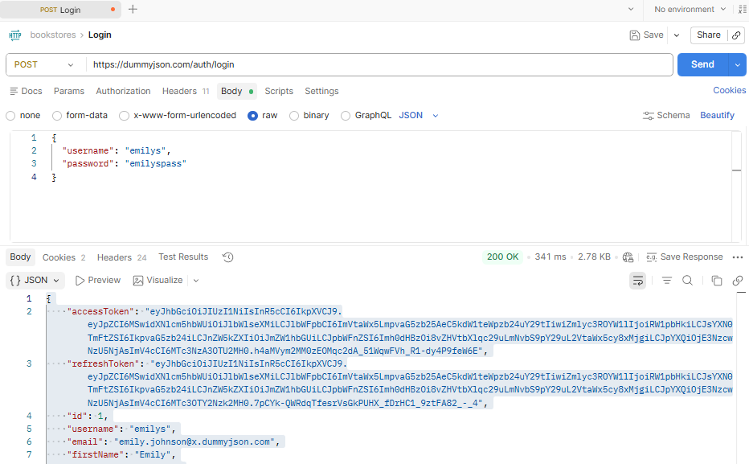
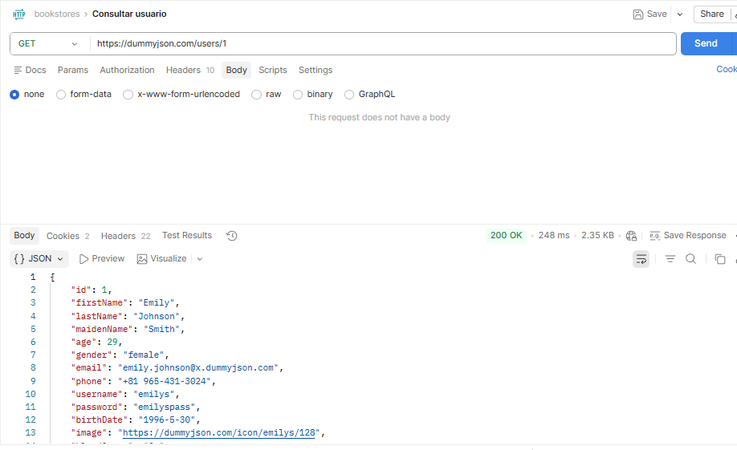
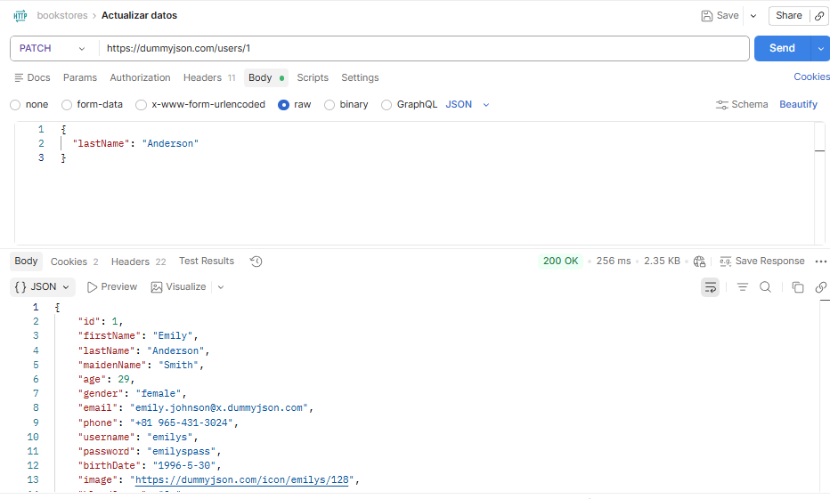
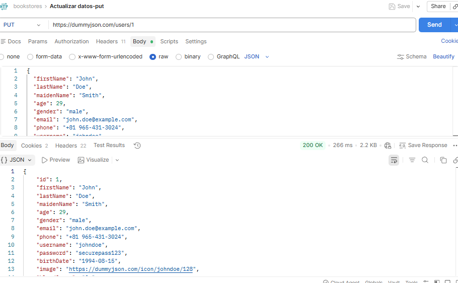
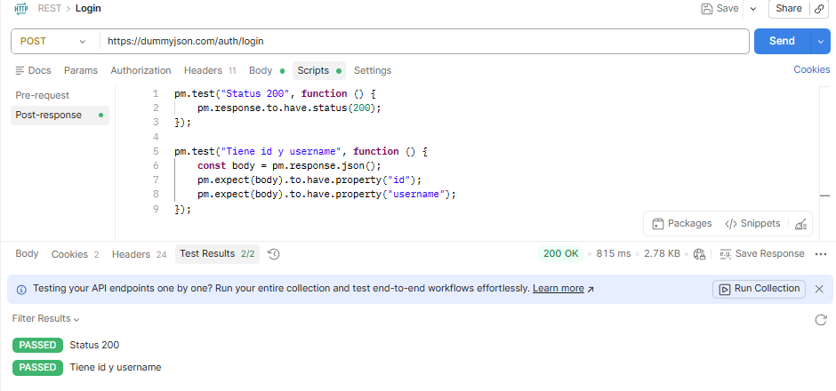

**Laboratorio de APIs con Postman**  
Michael Sebastian Caicedo Rosero

Elegí la API [https://dummyjson.com/](https://dummyjson.com/) porque permite trabajar con los principales métodos HTTP, como GET, POST, PATCH y PUT, necesarios para desarrollar el laboratorio. Además, esta API facilita la práctica de autenticación, ya que genera tokens de tipo access y refresh, lo que permite simular un flujo real de seguridad en las peticiones.

1.  Login: Se accede a un usuario ya existente utilizando el username “emilys”. Al ejecutar el método POST para autenticación, el servidor valida las credenciales y genera un accessToken y un refreshToken (JWT), los cuales permiten gestionar la sesión y realizar peticiones autenticadas. completamos la ruta con /auth/login. Además, se observa que se devuelven todos los datos relacionados con el usuario, como el id, el nombre de usuario, el correo electrónico, entre otros.  
**200 OK** → La solicitud fue exitosa, todo salió bien
 

2. Consultar usuario: Para consultar un usuario se utiliza el método GET. Solo es necesario proporcionar el ID del usuario, que en este caso es el número “1”; por lo tanto, la ruta final sería /users/1, con la cual se obtiene la información correspondiente a ese usuario.  
**200 OK** → La solicitud fue exitosa, todo salió bien
 

3. Actualizar datos: Para actualizar un dato específico de un usuario se utiliza el método PATCH. En este caso, se modifica únicamente el campo “lastName”, cambiándolo de “Smith” a “Anderson”, sin afectar el resto de la información del usuario. la ruta termina en users/{id} en este caso id=1.  
**200 OK** → La solicitud fue exitosa, todo salió bien
 

4. Actualizar datos completamente de un usuario: Para actualizar todos los datos de un usuario se utiliza el método PUT. La ruta es similar a la del método PATCH, es decir, termina en /users/{id}. En este caso, se reemplaza toda la información del usuario; por ejemplo, el nombre cambia de “Emily” a “John”.  
**200 OK** → La solicitud fue exitosa, todo salió bien
 

5. Test: El código define dos pruebas automáticas en Postman que se ejecutan después de enviar una petición. La primera valida que la respuesta del servidor tenga un estado HTTP 200, lo que indica que la solicitud fue exitosa; si se cumple, el test aparece como “Passed”, de lo contrario como “Failed”. La segunda prueba convierte la respuesta a formato JSON y verifica que el campo “username” tenga el valor “Developer”, confirmando que la actualización se realizó correctamente. Si el valor coincide, el resultado es “Passed”, y si no, “Failed”. De esta manera, ambos tests permiten comprobar automáticamente tanto el éxito de la petición como la correcta modificación de los datos.  
**200 OK** → La solicitud fue exitosa, todo salió bien  
 

6. A diferencia de JSONPlaceholder, en esta API aprendí a trabajar con datos reales y estructuras más complejas. También observé que se incluyen más campos relacionados con el usuario, como id, userName y email, lo que permite una gestión más completa de la información.  
Además, comprendí mejor el uso de códigos de estado HTTP y cómo interpretar las respuestas del servidor en distintos escenarios.

