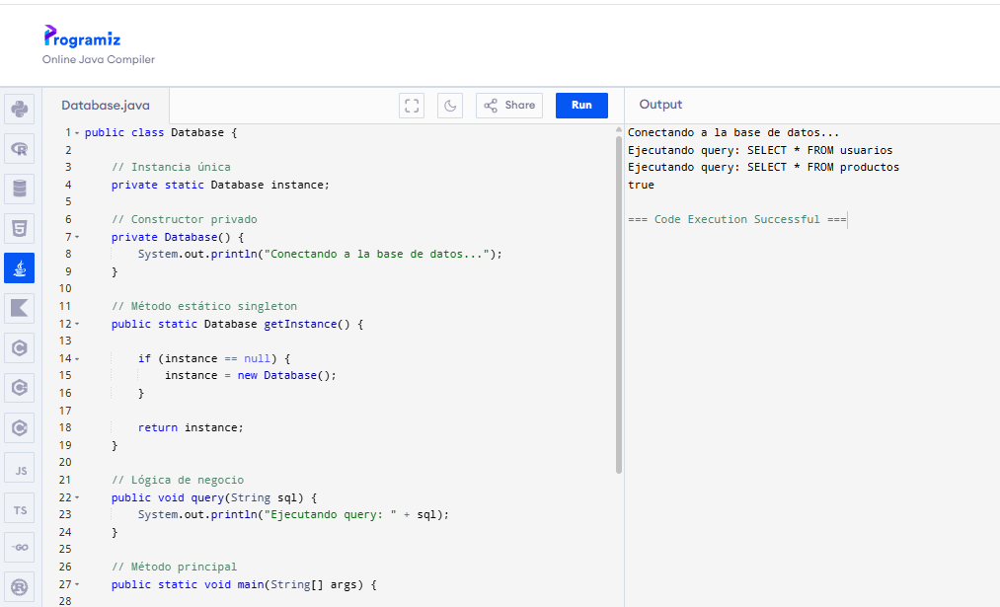
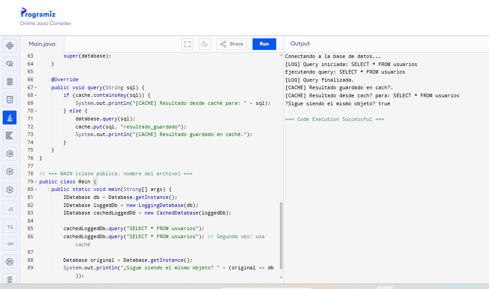
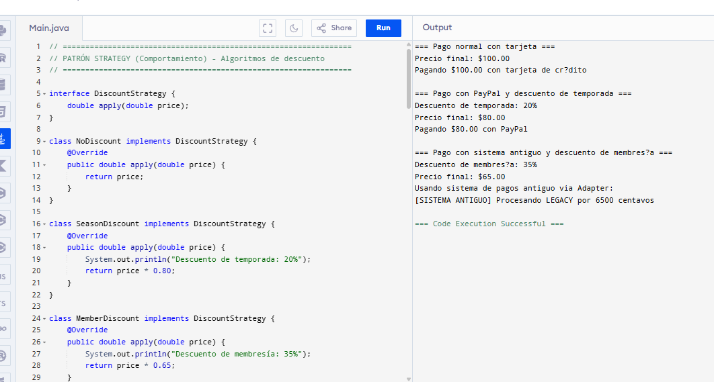

**Michael Sebastian Caicedo Rosero**

**1. Patrón Singleton**

Este código implementa el patrón de diseño **Singleton**. La idea es
simple: *solo puede existir una instancia de la base de datos*, o más
exactamente, un único objeto Database durante toda la ejecución del
programa. Esto es útil porque abrir múltiples conexiones a una base de
datos puede ser costoso en tiempo y recursos.

En lugar de crear objetos constantemente con:

new Database()

el programa reutiliza siempre la misma instancia.

**¿Cómo funciona el código?**

private static Database instance;

Esta línea guarda la única instancia de la clase. La palabra static
significa que la variable pertenece a la clase y no a un objeto
específico, por lo que existe una sola vez en memoria.

private Database()

El constructor es privado para impedir que otras clases creen objetos
usando new Database(). De esta manera, la propia clase controla la
creación de su única instancia.

public static Database getInstance()

Este es el método principal del patrón Singleton. Su función es
verificar si la instancia ya existe. Si no existe:

if (instance == null)

la crea:

instance = new Database();

Si ya fue creada anteriormente, simplemente devuelve la misma instancia.

La primera vez que se ejecuta:

Database foo = Database.getInstance();

se crea el objeto y aparece el mensaje:

Conectando a la base de datos\...

La segunda vez:

Database bar = Database.getInstance();

ya no se crea otro objeto; se reutiliza el existente.

Por eso, al ejecutar:

System.out.println(foo == bar);

el resultado es true, ya que foo y bar apuntan exactamente al mismo
objeto en memoria.

En resumen, el patrón Singleton garantiza que exista una única instancia
compartida en todo el programa. Es como tener una sola caja registradora
central que todos utilizan, en lugar de crear una nueva cada vez. El
patrón se basa en dos ideas principales: un constructor privado para
impedir la creación libre de objetos y un método estático getInstance()
para controlar y reutilizar la única instancia disponible.

**Parte 2: Singleton + Patrón Estructural (Decorator)**

En esta parte se combinan dos patrones de diseño: **Singleton** y
**Decorator**. La idea principal es que la única instancia de la base de
datos creada por el Singleton pueda recibir funcionalidades adicionales
sin modificar su código original.

La clase Database utiliza el patrón Singleton para asegurar que solo
exista una conexión a la base de datos durante toda la ejecución del
programa, evitando el costo de abrir múltiples conexiones.

Sobre esa única instancia se aplica el patrón **Decorator**, que
funciona como si fueran capas superpuestas. En lugar de modificar
directamente la clase original, se crean clases envoltorio que añaden
nuevas funcionalidades.

Por ejemplo:

-   LoggingDatabase agrega mensajes de registro antes y después de cada
    consulta.

-   CachedDatabase almacena en caché las consultas ya realizadas para
    evitar ejecutarlas nuevamente si se repiten.

Cuando el programa llama al método query(), la petición atraviesa cada
una de las capas hasta llegar finalmente a la base de datos real. La
ventaja es que estas funcionalidades pueden agregarse o quitarse
fácilmente sin modificar la implementación original de Database.

**¿Por qué Decorator es un patrón estructural?**

Decorator pertenece a los patrones estructurales porque organiza y
compone objetos mediante envolturas. En este caso, el Singleton sigue
siendo una única instancia, pero alrededor de él pueden añadirse
distintas capas de comportamiento, como logging, caché o métricas, de
forma flexible y extensible.

**3. Patrones Creacionales, Estructurales y de Comportamiento**

Los patrones de diseño se clasifican en tres grandes categorías:

-   **Creacionales:** controlan cómo se crean los objetos.

-   **Estructurales:** controlan cómo se organizan y conectan las clases
    y objetos.

-   **De comportamiento:** controlan cómo los objetos se comunican y
    distribuyen responsabilidades.

**Ejemplos intuitivos**

**Factory Method (Creacional)**

Factory Method funciona como un restaurante. El cliente pide una
hamburguesa sin preocuparse por cómo se prepara. La cocina se encarga de
crear el producto y entregarlo listo para usar.

**Adapter (Estructural)**

Adapter actúa como un traductor entre dos sistemas incompatibles.
Ninguno necesita cambiar su funcionamiento; el adaptador se encarga de
que ambos puedan comunicarse.

**Strategy (Comportamiento)**

Strategy es como elegir la forma de ir al trabajo: bus, bicicleta o
automóvil. El objetivo sigue siendo el mismo, pero el método puede
cambiar según la situación.

**Ejemplo conjunto de los tres patrones**

**Creacional → Factory Method**

Se utiliza una fábrica que crea diferentes métodos de pago, como
tarjeta, PayPal o efectivo, sin que el código principal conozca
exactamente qué clase está creando.

**Estructural → Adapter**

Se adapta un sistema de pagos antiguo con una interfaz incompatible para
que pueda funcionar con el sistema moderno.

**Comportamiento → Strategy**

Permite cambiar dinámicamente el algoritmo de descuento, por ejemplo:

-   descuento por temporada,

-   descuento por membresía,

-   o sin descuento.

**¿Cómo interactúan los tres patrones?**

El patrón **Strategy** decide primero qué descuento aplicar antes de
realizar el pago. La estrategia puede cambiar en tiempo de ejecución sin
modificar el resto del sistema.

Luego, **Factory Method** recibe el tipo de pago y devuelve el objeto
correspondiente. De esta forma, el main nunca necesita hacer
directamente:

new CardPayment()

Finalmente, **Adapter** permite integrar sistemas antiguos. Por ejemplo,
LegacyPayment puede utilizar un sistema viejo (OldPaymentSystem) como si
fuera moderno, adaptando diferencias como nombres de métodos o
conversiones de dólares a centavos.

La combinación de estos tres patrones permite construir un sistema
flexible, desacoplado y fácil de extender.

